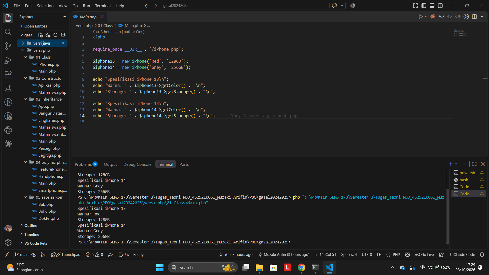

# Nama      : Muzaki Arifin
# NPM       : 4525210051
# Matkul    : PBO-A
# Tugas PBO – Konversi Java ke PHP

## Materi 01 – Class

**Folder:** `01 Class/` (`iPhone.php`, `Main.php`)

**Screenshot:**

**Penjelasan:**
- `class iPhone` punya dua *property*: `$color` dan `$storage`.
- Constructor di PHP namanya `__construct` (di Java namanya sama dengan nama class). Constructor dipanggil otomatis saat `new iPhone(...)` dan mengisi nilai property.
- `$this` merujuk ke objek yang sedang dipakai, sama seperti `this` di Java.
- `getColor()` dan `getStorage()` adalah getter yang mengembalikan nilai property lewat `return`.
- Di `Main.php`, dibuat dua objek (`$iphone13` dan `$iphone14`) dari class yang sama. Ini disebut *instantiation*. Hasilnya dua objek punya data yang berbeda.
- Beda sintaks dari Java: variabel diawali `$`, akses method pakai `->` (bukan `.`), dan gabung string pakai `.` (bukan `+`).

---

## Materi 02 – Constructor

**Folder:** `02 Constructor/` (`Mahasiswa.php`, `Aplikasi.php`)

**Screenshot:**

**Penjelasan:**
- Class `Mahasiswa` punya property `private` (`$nama`, `$nim`, `$umur`) yang hanya bisa diubah/dibaca lewat **getter** dan **setter** (*encapsulation*).
- Di Java ada 3 constructor (*overloading*): tanpa parameter, 2 parameter, dan 3 parameter. **PHP tidak mendukung overloading**, jadi diganti dengan **satu constructor yang punya default parameter** (`$nama = 'Belum Diisi'`, dst.). Hasilnya tetap bisa dipanggil dengan 0, 2, atau 3 argumen.
- `new Mahasiswa()` otomatis memakai nilai default ("Belum Diisi" dan umur 0).
- `new Mahasiswa('Nenden Nuraini', '4523210144', 17)` mengisi semua nilai langsung lewat constructor.
- `tampilkanInfo()` mencetak semua data mahasiswa.

---

## Materi 03 – Inheritance (Pewarisan)

**Folder:** `03 inheritance/` (`BangunDatar.php`, `Lingkaran.php`, `Persegi.php`, `Segitiga.php`, `Mahasiswa.php`, `MahasiswaInternational.php`, `App.php`, `Main.php`)

**Screenshot `App.php` (bangun datar):**

**Screenshot `Main.php` (mahasiswa internasional):**

**Penjelasan:**
- *Inheritance* = class anak mewarisi property dan method dari class induk memakai kata kunci `extends`.
- **Bangun datar:** `Lingkaran`, `Persegi`, dan `Segitiga` mewarisi `BangunDatar`. `Lingkaran` dan `Persegi` **meng-override** (menimpa) method `luas()` dan `keliling()` dengan rumusnya sendiri.
- `Segitiga` hanya meng-override `luas()` dan tidak meng-override `keliling()`, sehingga saat `keliling()` dipanggil, yang jalan adalah milik induk (`BangunDatar`) dan mencetak "Menghitung keliling bangun datar".
- **Mahasiswa:** `MahasiswaInternational extends Mahasiswa` dan menambah property `$negaraAsal`.
- `parent::__construct(...)` dipakai untuk memanggil constructor induk (di Java: `super(...)`). `parent::tampilkanInfo()` memanggil method induk lalu ditambah info negara asal.
- Karena PHP tidak punya constructor overloading, constructor `MahasiswaInternational` memakai default parameter dan mengecek tipe parameter ketiga (`is_int` / `is_string`): kalau berupa angka dianggap umur (4 argumen), kalau berupa teks dianggap negara asal (3 argumen), dan kalau kosong dipakai nilai default (0 argumen).

---

## Materi 04 – Polymorphism

**Folder:** `04 polymorphism/` (`Handphone.php`, `Smartphone.php`, `FeaturePhone.php`, `Main.php`)

**Screenshot:**

**Penjelasan:**
- *Polymorphism* = satu pemanggilan method yang sama, tapi hasilnya berbeda tergantung jenis objeknya.
- `Smartphone` dan `FeaturePhone` sama-sama turunan `Handphone` dan meng-override `nyalakan()`, `matikan()`, dan `telepon()` dengan perilaku masing-masing (misal smartphone "booting" dan video call, feature phone panggilan suara).
- Di `Main.php`, objek dimasukkan ke satu array `$daftarHandphone`. Saat di-*loop*, `$hp->nyalakan()` otomatis menjalankan versi milik Smartphone atau FeaturePhone.
- `instanceof` dipakai untuk mengecek jenis objek sebelum memanggil method khusus (`aksesInternet()` hanya ada di Smartphone, `mainGameSnake()` hanya ada di FeaturePhone). Di PHP tidak perlu *casting* seperti di Java.
- Property `protected` dipakai agar bisa diakses oleh class turunan.

---

## Materi 05 – Asosiasi, Agregasi, dan Komposisi

**Folder:** `05 asosiasikomposisi/` (`Dokter.php`, `Pasien.php`, `Tim.php`, `Pemain.php`, `Buku.php`, `Bab.php`, `Main.php`)

**Screenshot:**

**Penjelasan:**
- **Asosiasi** (`Dokter` – `Pasien`): hubungan paling longgar. `Dokter` hanya "memakai" objek `Pasien` lewat parameter method `merawat($pasien)`. Keduanya berdiri sendiri.
- **Agregasi** (`Tim` – `Pemain`): hubungan "punya", tapi objek `Pemain` dibuat **di luar** lalu dimasukkan ke `Tim`. Kalau `Tim` dihapus, `Pemain` tetap ada.
- **Komposisi** (`Buku` – `Bab`): hubungan "punya" yang paling kuat. Objek `Bab` dibuat **di dalam** constructor `Buku`, jadi hidupnya bergantung pada `Buku`. Saat `unset($buku)` dipanggil, bab ikut hilang.
- `List<Pemain>` di Java diganti dengan array biasa di PHP.

---

## Materi 06 – Abstract Class dan Interface

**Folder:** `06 abstractinterface/` (`Vehicle.php`, `Movable.php`, `Fuelable.php`, `Car.php`, `Boat.php`, `Motor.php`, `Building.php`, `Main.php`)

**Screenshot:**

**Penjelasan:**
- **Abstract class** `Vehicle` adalah kerangka dasar kendaraan (punya `$name` dan `showInfo()`). Class ini tidak bisa di-`new` langsung, hanya bisa diwarisi.
- **Interface** adalah kontrak: `Movable` mewajibkan method `move()`, `Fuelable` mewajibkan method `refuel()`. Class yang `implements` interface wajib mengisi method tersebut.
- `Car` dan `Boat` mewarisi `Vehicle` dan mengimplementasikan kedua interface. `Boat` punya `refuel()` khusus kapal.
- **Perbedaan dari Java:** interface di PHP tidak boleh punya *default method*. Sebagai gantinya dibuat **trait** `FuelableDefault` (ditulis di file `Fuelable.php`) yang berisi `refuel()` bawaan ("Mengisi bahan bakar umum."). `Motor` memakainya lewat `use FuelableDefault;` tanpa menulis ulang `refuel()`.
- `Building` hanya mewarisi `Vehicle` dan tidak implement interface apa pun, jadi hanya punya `showInfo()` (tidak punya `move()` dan `refuel()`).

---

## Ringkasan perbedaan Java dan PHP yang dipakai

| Java | PHP |
|---|---|
| `Konstruktor` bernama sama dengan class | `__construct` |
| `this.nama` | `$this->nama` |
| `System.out.println(...)` | `echo ... . PHP_EOL;` |
| `extends` / `super(...)` | `extends` / `parent::__construct(...)` |
| Constructor overloading | Default parameter / cek tipe parameter |
| `instanceof` + casting | `instanceof` saja |
| Default method di interface | `trait` |
| `List<T>` / `ArrayList` | `array` |